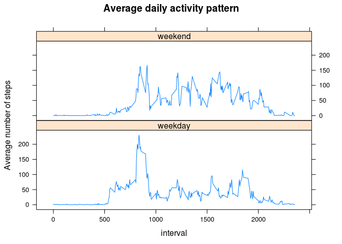

# Reproducible Research: Peer Assessment 1

Here we import the needed libs, and set the chunk options globally for this page:

```r
library(knitr)
library(ggplot2)
library(dplyr)
```

```
## 
## Attaching package: 'dplyr'
```

```
## The following objects are masked from 'package:stats':
## 
##     filter, lag
```

```
## The following objects are masked from 'package:base':
## 
##     intersect, setdiff, setequal, union
```

```r
opts_chunk$set(echo=TRUE)
```

## Loading and preprocessing the data

Let's unpack the ZIP archive and load the enclosed CSV data, parsing the dates, and making two data frames, one with NAs (`activity.all`), and one without NAs (`activity`):

```r
unzip("activity.zip")
activity.all <- read.csv("activity.csv")
activity.all$date <- as.Date(activity.all$date, "%Y-%m-%d")
activity <- na.omit(activity.all)
```

## Mean total number of steps taken per day

Let's sum the steps by days:

```r
daily.steps <- aggregate(steps~date, data = activity, FUN = sum)
```

Histogram of daily steps: 

```r
with(daily.steps, hist(steps))
```

<!-- -->

Let's compute the mean and median:

```r
mean <- mean(daily.steps$steps)
median <- median(daily.steps$steps)
```

- Mean: 10766.1886792453.
- Median: 10765.

## Average daily activity pattern

Let's aggregate the steps by interval, across all days:

```r
mean.by.interval <- activity %>% dplyr::group_by(interval) %>% dplyr::summarise(mean = mean(steps))
```

Now we can plot it:

```r
plot(mean.by.interval$interval, mean.by.interval$mean, type = "l",
     main = "Average daily activity pattern",
     xlab = "5-minute interval",
     ylab = "Average number of steps")
```

<!-- -->

Now we are finding out which interval has the maximum number of steps in average:

```r
index <- which.max(mean.by.interval$mean)
interval <- mean.by.interval$interval[index]
value <- mean.by.interval$mean[index]
```
The interval 835 has the highest mean number of steps (206.169811320755).

## Imputing missing values

Number of rows with NAs:

```r
nrow(activity.all) - nrow(activity)
```

```
## [1] 2304
```

To fill in the missing values, we will use the mean (that was computed above) to replace the NAs and create a new data frame (`activity.fixed`):

```r
activity.fixed <- activity.all
activity.fixed$mean <- mean.by.interval$mean # source will be repeated for each day into dest
activity.fixed$steps[is.na(activity.fixed$steps)] <- activity.fixed$mean[is.na(activity.fixed$steps)]
```
The dataset `activity.fixed` now has the NAs replaced by the means.

Histogram of daily steps: 

```r
daily.steps2 <- aggregate(steps ~ date, data=activity.fixed, FUN=sum)
with(daily.steps2, hist(steps))
```

<!-- -->

Let's compute the imputed mean and median:

```r
mean2 <- mean(daily.steps2$steps)
median2 <- median(daily.steps2$steps)
```

- Imputed mean: 10766.1886792453 (was 10766.1886792453).
- Imputed median: 10766.1886792453 (was 10765).

Imputing missing data (using the mean) obviously preserves the mean but changes the median.

## Differences in activity patterns between weekdays and weekends

Let's separate entries for weekend from weekdays, and compute the means by interval:

```r
is.weekend <- weekdays(activity.fixed$date) %in% c("Saturday", "Sunday")

activity.mean.weekdays <- group_by(activity.fixed[!is.weekend,], interval) %>% summarize(mean = mean(steps))
activity.mean.weekend <- group_by(activity.fixed[is.weekend,], interval) %>% summarize(mean = mean(steps))
```

Let's create a new variable, `daytype`, and bind all as a single data frame:

```r
activity.mean.weekdays$daytype = "weekday"
activity.mean.weekend$daytype = "weekend"
activity.mean <- rbind(activity.mean.weekend, activity.mean.weekdays)
```

Now we can make a two-panels plot:

```r
library(lattice) 
xyplot(mean~interval|daytype, data=activity.mean, type = 'l', layout = c(1,2),
       main = "Average daily activity pattern",
       ylab = "Average number of steps")
```

<!-- -->
